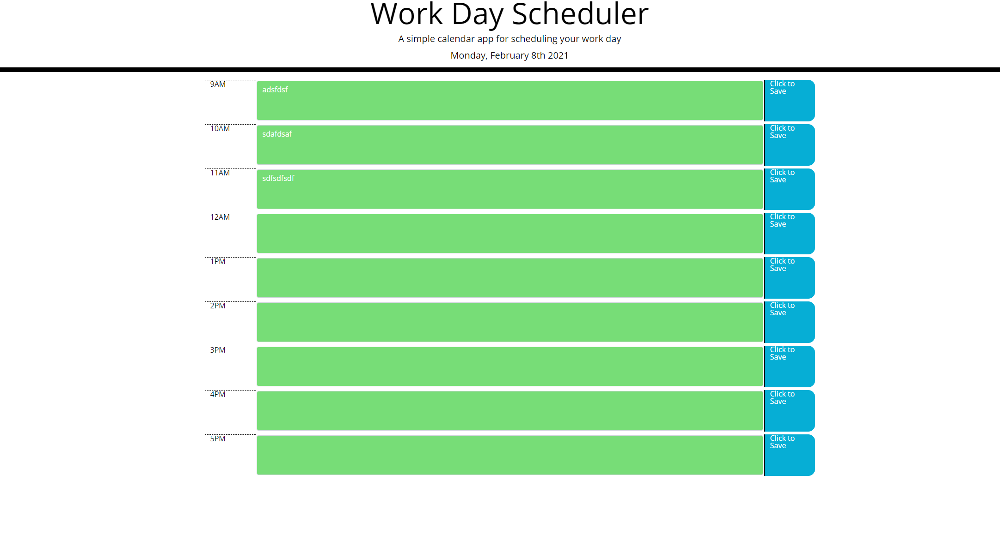

# homework5---Day-Planner
The code here is for a Day Planner. The sitee colours past, present , and future timeblock differently as well as saves text for the specific timeslot.

URL:https://adamaranha.github.io/homework5---Day-Planner/

Screenshot:

